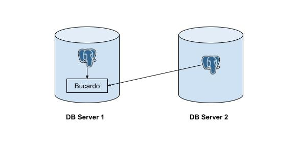
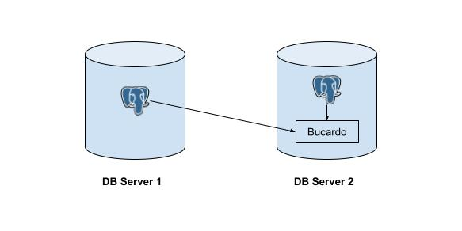
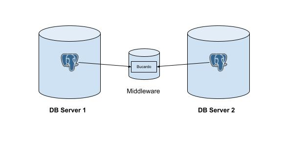

Bucardo - a table-based replication system

DESCRIPTION:
------------

This repository is a fork of version 5.6.0 of Bucardo. I'll be trying out tests and configuring few scenarios to set up trigger based replication between two PostgreSQL clusters, using Bucardo.

POSSIBLE ARCHITECTURE:
----------------------

Below are the list of possible architecture, to deploy Bucardo between two DB instances:

1. **Bucardo on Server 1**: This idea involves performing Bucardo Replication between two host machines, where Bucardo resides in the same node as DB Server 1.



2. **Bucardo on Server 2**: This idea involves performing Bucardo Replication between two host machines, where Bucardo resides in the same node as DB Server 2.



3. **Bucardo on Middleware**: This idea involves performing Bucardo Replication between two host machines, where Bucardo resides in a separate node, between the two DB instances.



TEST SCENARIO:
--------------

For our testing purposes, we'll be deploying Bucardo using Architecture 3 i.e. `Bucardo on a Middleware`. This should give us some extra information.

Also, we'll be configuring multi-master replication for this.

PREREQUISITE:
-------------

To get started with the hand-on example, we need to have following components up an ready:

- Two PostgreSQL Instances on a remote server
- A Linux Machine *(preferably Ubuntu or any debian based)*
- Git
- OpenSSH Server
- Basic Bash Command
- Basic Perl Scripting

SETUP:
------

For our tutorial, we'll be using following machines to set up our Bucardo Cluster:

| S.N | Hostname | IP Address | Provision | Remarks | 
| --- | -------- | ---------- | --------- | ------- |
| 1 | pg-server1 | 192.168.0.1 | DB Server1 | Remote Server hosted on AWS |
| 2 | pg-server1 | 192.168.0.2 | DB Server2 | Remote SErver hosted on GCP |
| 3 | bucardo-server | 192.168.0.3 | Bucardo Middleware | Local Server hosted for Bucardo Deployment |

## Execute the following commands in your Bucardo Middleware

Clone the github repository of `Bucardo` to your local middleware machine:

```bash
git clone git@github.com:bucardo/bucardo.git
```
